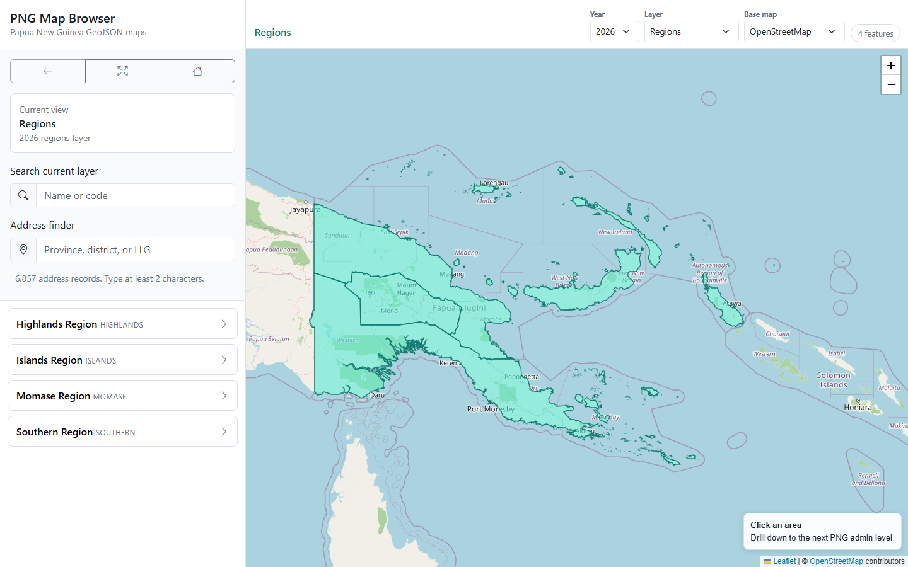

# PNG JSON Maps

> Open Papua New Guinea administrative boundary maps (GeoJSON + TopoJSON) and an address hierarchy / autocomplete dataset, plus a ready-to-run map browser. Built for frontend apps, map browsing, and address autocomplete.

Created by **Roniel Nuqui** / **[@phatneglo](https://github.com/phatneglo)**.



This project generates a PNG map package similar in spirit to `philippines-json-maps`, but adapted to Papua New Guinea's administrative structure:

```text
country -> region -> province -> district -> LLG -> ward
```

The current open `gbOpen` source output contains usable boundaries down to **LLG**. Ward folders are kept for compatibility, but the 2026 generated ward GeoJSON is an empty placeholder because ADM4/ward geometry is not available from the selected open source. Ward *names* are still included in the address dataset as text-only records.

---

## Contents

- [What You Get](#what-you-get)
- [Try the Demo](#try-the-demo)
- [Generate the Data](#generate-the-data)
- [Output Structure](#output-structure)
- [Using the Address JSON](#using-the-address-json)
- [Address Data Exports](#address-data-exports)
- [The Map Browser](#the-map-browser)
- [Frontend Loading Pattern](#frontend-loading-pattern)
- [PNG vs Philippine Admin Levels](#png-vs-philippine-admin-levels)
- [Source and Attribution](#source-and-attribution)
- [License](#license)

---

## What You Get

| Folder | What's inside | Use it for |
| --- | --- | --- |
| `png-json-maps/<year>/` | GeoJSON + TopoJSON for country, regions, provinces, districts, LLGs (ward folder is a placeholder) | Drawing maps, drill-down navigation |
| `png-json-address/<year>/` | Address hierarchy JSON + flat autocomplete records, with supplemental ward names | Cascading selects, autocomplete |
| `address-data/<year>/` | The same address data exported as JSON, CSV, XML, and SQL | Import into spreadsheets, ETL, databases |
| `png-map-browser/` | Standalone Leaflet + Bootstrap browser (no CDN dependencies) | Viewing layers and searching addresses in a browser |
| `scripts/` | Python generators for the maps and address JSON | Regenerating or adding new years |

What's in the **2026** output today:

```text
regions: 4      districts: 87     ward address records: 6418
provinces: 22   llgs: 326         autocomplete records: 6857
```

(Ward *boundary* geometry: 0 — see note above.)

---

## Try the Demo

The map browser is a static site — it just needs a local web server (browser `fetch()` cannot load local JSON from `file://`).

**One command (recommended):**

```powershell
powershell -ExecutionPolicy Bypass -File .\serve_demo.ps1
```

This refreshes the catalog, starts a server on port `8080`, and opens
<http://localhost:8080/png-map-browser/> in your browser. Use `-Port 8099` to change the port or `-NoOpen` to skip launching the browser.

**Or manually:**

```powershell
python .\png-map-browser\build_catalog.py
python -m http.server 8080
# then open http://localhost:8080/png-map-browser/
```

In the browser you can:

- switch **year**, **layer** (country → regions → provinces → districts → LLGs), and **base map** (OpenStreetMap, CARTO Light, or none)
- click an area to **drill down** to the next admin level
- search the current layer by name or code
- use the **address finder** to jump to any province, district, or LLG

> **Want a hosted demo?** Because the browser resolves data from `../png-json-maps`, you can publish the whole repository with GitHub Pages and open `/<repo>/png-map-browser/`. Run `python .\png-map-browser\build_catalog.py` before committing so `catalog.json` is up to date.

---

## Generate the Data

If you cloned the repo and want to (re)generate everything from the open source data, run from Windows PowerShell:

```powershell
powershell -ExecutionPolicy Bypass -File .\setup_and_generate_png_maps.ps1 -Year 2026
```

This will:

- check/install required tooling where possible (Python, Node, mapshaper)
- create a local Python virtual environment
- download PNG open boundary data
- generate GeoJSON and TopoJSON files
- generate the address hierarchy and autocomplete JSON
- export address data to JSON, CSV, XML, and SQL
- refresh the map browser catalog

To also try ADM4 / ward geometry (skipped safely if unavailable):

```powershell
powershell -ExecutionPolicy Bypass -File .\setup_and_generate_png_maps.ps1 -Year 2026 -IncludeWards
```

---

## Output Structure

```text
png-json-maps/
  2026/
    geojson/   { country, regions, provinces, districts, llgs, wards }
    topojson/  { country, regions, provinces, districts, llgs, wards }
    index.json
    metadata.json

png-json-address/
  2026/
    address-hierarchy.json
    address-flat.json

address-data/
  README.md
  2026/
    metadata.json  schema.json
    address-records.json   address-hierarchy.json
    address-records.csv    address-records.xml
    png-address-data.sql

png-map-browser/
  index.html
  assets/   vendor/   docs/
  catalog.json
```

---

## Using the Address JSON

Use `address-flat.json` for autocomplete:

```json
{
  "code": "PG-CPK-D001-L001",
  "name": "Chuave Rural LLG",
  "level": "llg",
  "label": "Chuave Rural LLG, Chuave District, Chimbu (Simbu) Province, Highlands Region, Papua New Guinea",
  "code_system": "png-json-maps-generated",
  "standard_code": "",
  "is_standard_code": false,
  "region_code": "HIGHLANDS",
  "province_code": "PG-CPK",
  "district_code": "PG-CPK-D001",
  "llg_code": "PG-CPK-D001-L001"
}
```

Use `address-hierarchy.json` for cascading selects:

```text
country
  regions[]
    provinces[]
      districts[]
        llgs[]
          wards[]
```

It also includes an `administrative_hierarchy` section so apps can understand which deeper levels are available:

```text
country -> region -> province -> district -> LLG -> ward -> census unit
```

For 2026, `ward.available_in_address_json` is `true` (text-only ward names are included from `papua-new-guinea-geolist`), while `ward.available_as_boundary` is `false` (no ADM4/ward geometry in the current source).

### Code Standards

This is **not** a PNG version of PSGC. The generated JSON is explicit about code provenance:

- Country code `PNG` uses ISO 3166-1 alpha-3.
- Province codes such as `PG-CPM`, `PG-NCD`, `PG-NSB` use ISO 3166-2:PG-style subdivision codes from the source `shapeISO`.
- Region codes such as `HIGHLANDS` and `MOMASE` are package grouping codes.
- District and LLG codes such as `PG-CPM-D001` and `PG-CPM-D001-L001` are generated stable package codes (the source has blank `shapeISO` for ADM2/ADM3).
- Ward address codes such as `PG-SAN-D004-L003-W001` are generated from supplemental text data and parent LLG matches. They do **not** imply ward boundary geometry or an official registry code.

Every address record carries provenance fields — check `is_standard_code` before treating a code as an official external registry code:

```text
code_system   standard_code   is_standard_code
source_code   source_code_column   code_note
```

Each ward address record additionally includes:

```text
level: ward        matched_to_map     has_boundary: false
geometry_available: false             source_dataset
```

---

## Address Data Exports

Use `address-data/<year>/` when you need import-ready files outside the map browser:

| File | Format |
| --- | --- |
| `address-records.json` | Canonical flat records with metadata and schema |
| `address-hierarchy.json` | Nested hierarchy |
| `address-records.csv` | UTF-8 CSV for spreadsheets and ETL |
| `address-records.xml` | XML document exchange |
| `png-address-data.sql` | PostgreSQL-compatible table, inserts, metadata, indexes |
| `schema.json` | Field definitions |
| `metadata.json` | Counts and source notes |

Use `record_id` as the unique row key. The `code` field is useful for lookups, but some supplemental ward source records can share generated codes.

---

## The Map Browser

`png-map-browser/` is a self-contained Leaflet + Bootstrap app with **no CDN dependencies** — Leaflet, Bootstrap, and Bootstrap Icons are vendored under `png-map-browser/vendor/`. It reads each year's `index.json` (drill-down) and `address-flat.json` (search).

See [Try the Demo](#try-the-demo) to run it. To deploy it as a standalone folder, copy the data beside it and rebuild the catalog:

```text
png-map-browser/
  index.html   assets/   vendor/   catalog.json
  png-json-maps/<year>/index.json
  png-json-address/<year>/address-flat.json
```

```powershell
python .\png-map-browser\build_catalog.py
```

When you generate a new year, refresh the catalog and it appears in the year selector automatically.

---

## Frontend Loading Pattern

For map drill-down, load `png-json-maps/<year>/index.json`:

```text
regions -> click region -> load provinces -> click province
        -> load districts -> click district -> load LLGs
```

For autocomplete, load `png-json-address/<year>/address-flat.json`.
For cascading selectors, load `png-json-address/<year>/address-hierarchy.json`.

---

## PNG vs Philippine Admin Levels

PNG does not use Philippine-style City/Municipality the same way. A practical mapping for app design:

| Philippines | PNG equivalent |
| --- | --- |
| Province | Province |
| City / Municipality | LLG |
| Barangay | Ward (when available) |
| Subdivision / Street | Census Unit / Village / Locality / Street / Household point |

The closest PNG equivalent to a Philippine barangay is generally a **Ward** under an LLG. Below ward, PNG census workflows may use **Census Units**, which are not in the current open boundary dataset.

---

## Source and Attribution

The default automatic source is geoBoundaries `gbOpen`, which provides programmatic API access and GeoJSON download URLs. When using generated data publicly, include attribution for the source boundary datasets listed in each year's `metadata.json`.

Useful references:

- [HDX — PNG common operational boundaries (ADM 0–3 = country → LLG)](https://data.humdata.org/dataset/cod-ab-png)
- [PNG National Statistical Office — census figures by wards](https://www.nso.gov.pg/wpfd_file/census-figures-by-wards-islands-region/)
- [geoBoundaries / HDX PNG ADM3 (LLG-level geometries)](https://data.humdata.org/organization/geoboundaries)
- [Wilfred Wulbou's MIT-licensed PNG GeoList (supplemental ward names)](https://github.com/wilfred-wulbou/papua-new-guinea-geolist)

---

## License

Add a repository license before publishing if this will be shared for public reuse. Recommended: MIT for the code, with clear attribution notes for the generated boundary data.
